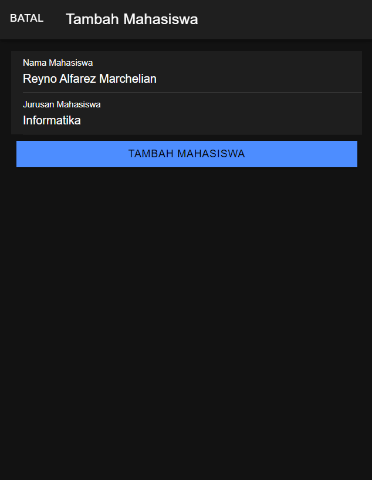
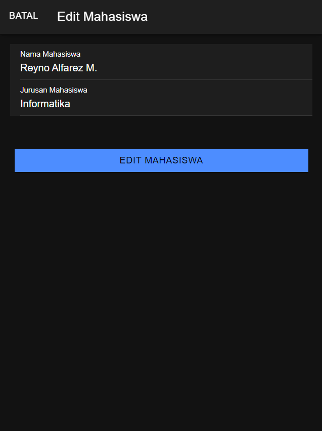
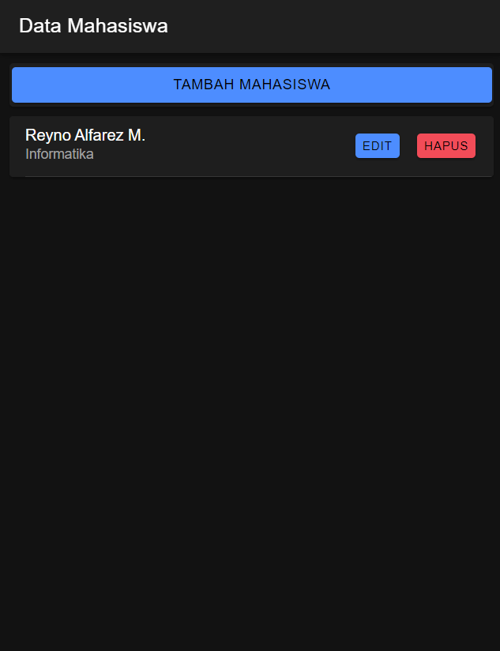

# Tugas 8 Praktikum Pemrograman Mobile

Nama: Reyno Alfarez Marchelian

NIM: H1D022111

Shift: B

## Tampilan Awal

## Tampilan Tambah Mahasiswa

Endpoint: POST /tambah.php

Fungsi tambahMahasiswa() mengambil nilai input dari form dan mengirim data ke tambah.php menggunakan fungsi this.api.tambah(data, 'tambah.php'). 
Data mahasiswa diterima API. Jika nama dan jurusan tidak kosong, data disimpan ke tabel mahasiswa  
Kemudian data mahasiswa akan direfresh dan modal tambah mahasiswa akan ditutup dengan fungsi this.modal.dismiss();.

## Tampilan Daftar Mahasiswa Setelah Penambahan Data

## Tampilan Edit Mahasiswa

Fungsi editMahasiswa() mengambil nilai input dari form dan mengirim data ke edit.php menggunakan fungsi this.api.edit(data, 'edit.php'). 
Data mahasiswa yang baru akan diterima API. Data yang baru akan disimpan ke tabel mahasiswa, kemudian data mahasiswa akan direfresh dan modal edit mahasiswa akan ditutup menggunakan fungsi this.modal.dismiss().

## Tampilan Daftar Mahasiswa Setelah Editing

## Tampilan Konfirmasi Hapus Data

fungsi hapusMahasiswa(id: any) menerima parameter ID mahasiswa yang ingin dihapus.  
Fungsi this.api.hapus(id, 'hapus.php?id=') digunakan untuk mengirim permintaan hapus ke endpoint API hapus.php.

## Tampilan Daftar Mahasiswa Setelah Data Dihapus

